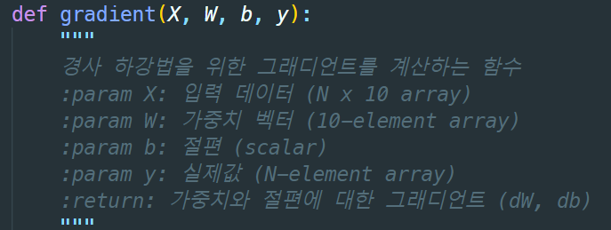
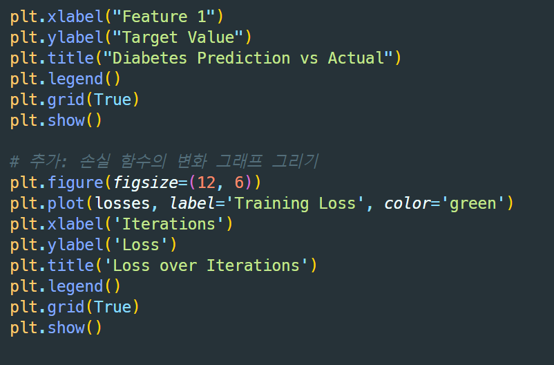

# Exploration

## AIFFEL Campus Online Code Peer Review Templete
- 코더 : 김영만 님
- 리뷰어 : 김천지 님


### PRT(Peer Review Template)
- [X]  **1. 주어진 문제를 해결하는 완성된 코드가 제출되었나요?**
    - 두 개의 주피터 파일이 모두 완성되어 있는 것을 확인하였다.
    
- [X]  **2. 전체 코드에서 가장 핵심적이거나 가장 복잡하고 이해하기 어려운 부분에 작성된 
주석 또는 doc string을 보고 해당 코드가 잘 이해되었나요?**   
    - MSE(), loss(), gradient()와 같은 함수들의 파라미터가 자세히 설명되어 있다.   
    -  
        
- [X]  **3. 에러가 난 부분을 디버깅하여 문제를 해결한 기록을 남겼거나
새로운 시도 또는 추가 실험을 수행해봤나요?**   
    - 피어 리뷰 과정에서 서로의 코드를 확인하며 피드백이 오갔다.   
    - 피어 리뷰 이후, 9-2까지 프로젝트를 성공적으로 마무리한 것을 확인할 수 있었다.
        
- [X]  **4. 회고를 잘 작성했나요?**
    - 모델 학습 과정에서의 loss를 그래프로 잘 나타낸 것을 확인할 수 있다.  
    - 모델이 예측한 레이블과 실제 레이블의 모습을 시각화하여 결과를 쉽게 확인하도록 하였다.   
    -     

    
- [X]  **5. 코드가 간결하고 효율적인가요?**
    - 코드에 주석이 잘 달려있다.  
    - 주석 없이도 코드가 무슨 역할을 하는지 직관적으로 확인이 가능하다.


## 회고(참고 링크 및 코드 개선)
```

```

