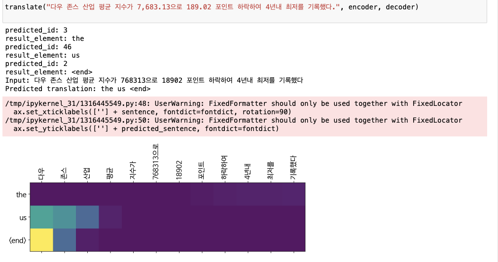
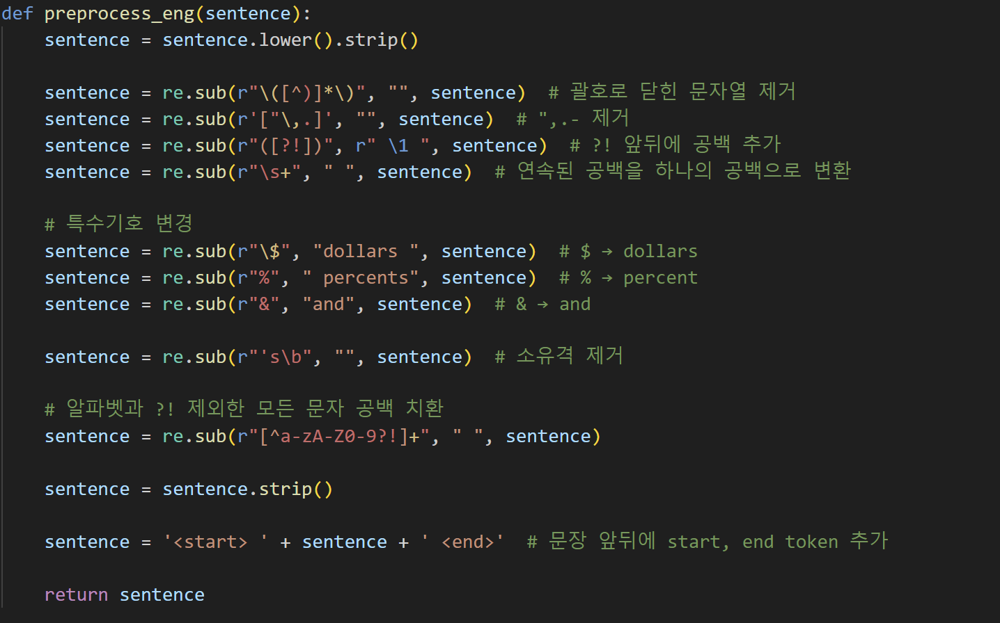
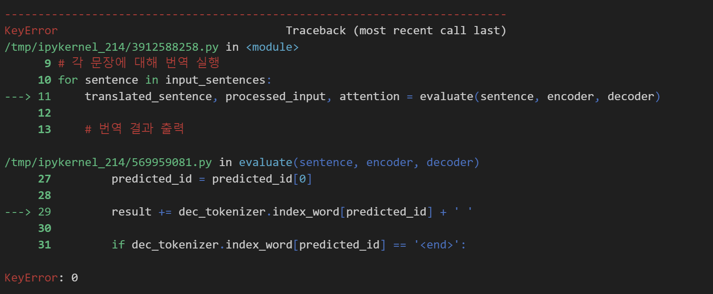
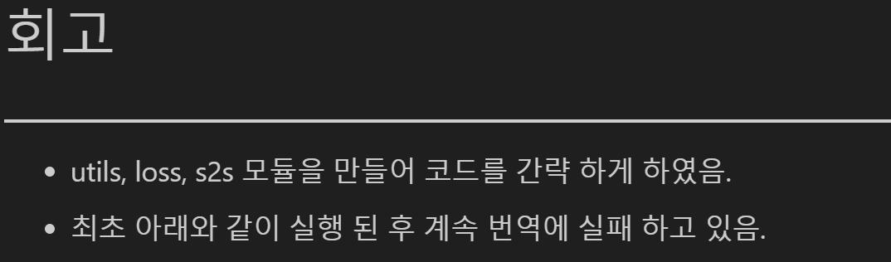
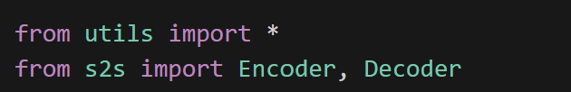

# AIFFEL Campus Online Code Peer Review Templete
- 코더 : 김영만
- 리뷰어 : 손병진

# PRT(Peer Review Template)
- [x]  **1. 주어진 문제를 해결하는 완성된 코드가 제출되었나요?**
    - seq2seq 인코더, 디코더, 바다나우 어탠션 코드와 결과가 첨부되어 있음.
        - 
    
- [x]  **2. 전체 코드에서 가장 핵심적이거나 가장 복잡하고 이해하기 어려운 부분에 작성된 주석 또는 doc string을 보고 해당 코드가 잘 이해되었나요?**
    - 각 코드마다 주석처리하여 코드로 알아보긴 정규표현식의 가독성을 높임.
        - 
        
- [x]  **3. 에러가 난 부분을 디버깅하여 문제를 해결한 기록을 남겼거나 새로운 시도 또는 추가 실험을 수행해봤나요?**
    - 발생한 코드 에러에 대해서 고민하고 해당 문제를 해결하기위해 계속 추적 중.
        - 
        
- [x]  **4. 회고를 잘 작성했나요?**
    - 프로젝트 결과에 대하여 간결하게 정리하여 작성함.
        - 
        
- [x]  **5. 코드가 간결하고 효율적인가요?**
    - 코드를 모듈화하여 프로젝트 메인 코드가 깔끔하고 가독성이 좋음.
        - 

# 회고(참고 링크 및 코드 개선)
- 코드를 모듈화 하여 정리하니 main 코드도 짧아지고 관리가 잘 되는거같아서 제 코드에도 적용시켜 보겠습니다.
- 프로젝트 실험 결과가 좋지않아도 지속적으로 디버깅하는 모습이 인상깊었습니다.
